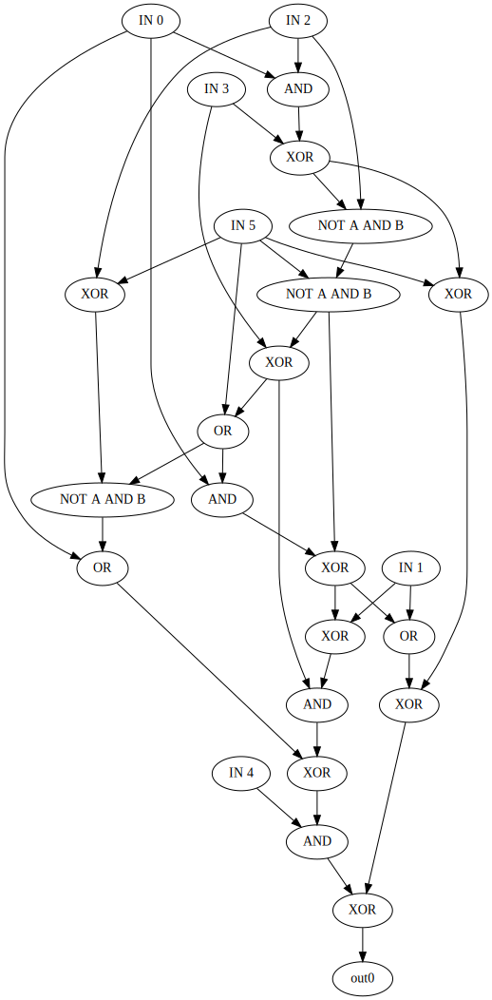

# sboxgates
[](https://doi.org/10.21105/joss.02946)
[](https://doi.org/10.5281/zenodo.891020)
[](https://www.gnu.org/licenses/gpl-3.0)
[](https://travis-ci.com/github/dansarie/sboxgates)
[](https://coveralls.io/github/dansarie/sboxgates)

Program for finding low gate count implementations of S-boxes. S-boxes are often the only nonlinear
components in modern block ciphers. Thus, low gate count implementations can be useful for
cryptanalysis and fast implementations in hardware or software.

The algorithm used is described in [Kwan, Matthew: "Reducing the Gate Count of Bitslice DES."
IACR Cryptology ePrint Archive 2000 (2000): 51](https://ia.cr/2000/051). Improvements from the
GitHub project [SBOXDiscovery](https://github.com/tripcode/SBOXDiscovery) have been added. The
program supports searching for gates using any subset of the 16 standard two-input boolean gates.
Additionally, the program also supports 3-bit LUTs. The latter can be used to find efficient
implementations for use on Nvidia GPUs that support the LOP3.LUT instruction, or on FPGAs.

* [Dependencies](#dependencies)
* [Build](#build)
* [Test](#test)
* [Run](#run)
  * [Command examples](#command-examples)
  * [Single output](#single-output)
  * [Multiple iterations](#multiple-iterations)
  * [Selecting gates](#selecting-gates)
  * [Metrics](#metrics)
  * [Permuting S-boxes](#permuting-s-boxes)
* [Contributing](#contributing)
* [Citing](#citing)
* [License and Copyright](#license-and-copyright)

#### Graph representation of output bit 0 of DES S1 generated with sboxgates and Graphviz


## Dependencies

* [CMake](https://github.com/Kitware/CMake) version 3.9 or later (for build)
* [libxml2](https://github.com/GNOME/libxml2)
* An MPI implementation such as [MPICH](https://github.com/pmodels/mpich) or
  [Open MPI](https://github.com/open-mpi/ompi)
* [Graphviz](https://github.com/ellson/graphviz) (for generating visual representations)

## Build

The following commands will build sboxgates on Debian-based Linux distributions, such as Ubuntu.

```
sudo apt-get install cmake graphviz libmpich-dev libxml2-dev mpich
mkdir build
cd build
cmake ..
make
```

## Test

Tests are run automatically by [Travis CI](https://travis-ci.com/dansarie/sboxgates) on each new
commit. The tests are documented in the testing script [.travis.yml](.travis.yml). Code coverage
reports are available from [Coveralls](https://coveralls.io/github/dansarie/sboxgates).

## Run

This program uses MPI for parallelization and should generally be run with the mpirun utility.
Graph generation without LUTs (i.e. without the `--lut` argument) is not parallelized and the
program can safely be run without MPI in those cases. The number of processes to use for the
parallelized operations can be selected using the `-n` flag to mpirun. `man mpirun` should provide
documentation on the options available for controlling execution and parallelization

The `--help` command line argument will display a brief list of command line options. The only
required argument is the path of an S-box file. S-box files are text files that contain an S-box
lookup table in hex format, with the values separated by whitespace. See
[rijndael.txt](sboxes/rijndael.txt) for how the
[AES S-box](https://en.wikipedia.org/wiki/Rijndael_S-box) is represented.

Generated graphs are saved as XML files, using the schema specified in [gates.xsd](gates.xsd). They
should be fairly easy to understand since each gate in the generated graph is represented by one
tag. The output files are named according to the pattern A-B-C-D-E.xml where A is the
number of output bits, B the number of gates, C the SAT metric (if applicable), D the output bit
numbers in the order they were added to the graph, and E a simple hash of the particular graph.

The program can convert the XML files to C or CUDA functions. This is enabled by the `-c`
argument. Graphs that include at least one LUT are converted to CUDA functions and graphs without
LUTs are converted to C functions. For visualization of the generated graphs, they can be converted
to Graphviz DOT format with the `-d` argument.

### Command examples

Generate a logic circuit representation of the Rijndael S-box:
```
./sboxgates ../sboxes/rijndael.txt
```

Generate a LUT circuit for output bit 0 of the Rijndael S-box:
```
mpirun ./sboxgates --lut --single-output 0 ../sboxes/rijndael.txt
```

Generate a LUT circuit for output bit 0 of the Rijndael S-box using 8 processes for the
parallelized search:
```
mpirun -n 8 ./sboxgates --lut --single-output 0 ../sboxes/rijndael.txt
```

Visualize a generated circuit with Graphviz:
```
./sboxgates -d 1-067-162-3-c32281db.xml | dot -Tpng > 1-067-162-3-c32281db.png
```

Convert a generated circuit to C/CUDA:
```
./sboxgates -c 1-067-162-3-c32281db.xml > 1-067-162-3-c32281db.c
```

### Single output

It is possible to generate graphs for just a single output bit of the S-box by using the
`--single-output` argument followed by a bit number. The least significant output bit is bit 0. This
can, for example, be used to generate separate functions for each single bit in an S-box to reduce
register pressure in bitslicing implementations.

Graphs can be built one output at a time by combining the `--single-output` with `--graph` to load
a previously generated graph. This can be used to manually control the build order and to keep the
total build time down.

### Multiple iterations

The `--iterations` argument can be used to make the program do more than one search iteration for
each output bit. This will often result in smaller output graphs being found, at the cost of much
longer search time. It is most suitable for use together with `--single-output`.

### Selecting gates

The `--available-gates` command line argument is used to specify the two-input gates gates that are
available for the search. The argument value is a bitfield, where each bit represents one gate
type. To specify the gates to be used, add up their values from the table below and pass the sum as
the value of the `--available-gates` argument. If no such argument is specified, the default is
194, i.e. AND, OR, and XOR. The `--append-not` flag can also be used to increase the number of
gates used for the search, by generating versions of the available gates with inverted outputs.
This can both increase and decrease the size of generated graphs.

When the `--verbose` flag is used, the program starts by printing out the 2- and 3-input gates that
have been generated and will be used for the search. Generation with LUTs will always include all
3-input gates, regardless of the result of this generation.

| Gate        | Value |
| ----------- | ----- |
| FALSE       |     1 |
| AND         |     2 |
| A AND NOT B |     4 |
| A           |     8 |
| NOT A AND B |    16 |
| B           |    32 |
| XOR         |    64 |
| OR          |   128 |
| NOR         |   256 |
| XNOR        |   512 |
| NOT B       |  1024 |
| A OR NOT B  |  2048 |
| NOT A       |  4096 |
| NOT A OR B  |  8192 |
| NAND        | 16384 |
| TRUE        | 32768 |

### Metrics

The default metric used in the search is the number of gates in the generated graph. An alternative
metric can be selected with the `--sat-metric` argument. Instead of minimizing the number of gates,
it attempts to minimize the size of the
[CNF](https://en.wikipedia.org/wiki/Conjunctive_normal_form) representation of the generated graph.
It is meant to improve the performance when the graph is used with
[SAT](https://en.wikipedia.org/wiki/Boolean_satisfiability_problem) solvers.

### Permuting S-boxes

The `--permute` argument can be used to permute the S-box input by XORing it with a constant value,
so that the S-box value for input value I becomes S(I ^ V), where V is the permutation value.

## Contributing

Reports on bugs and other issues are welcome. Please don't hesitate to open a new
[issue](https://github.com/dansarie/sboxgates/issues).

Likewise, contrubutions to code or documentation in the form of
[pull requests](https://github.com/dansarie/sboxgates/pulls) are welcomed.

## Citing

If you use sboxgates in a report or scientific publication, please cite the corresponding article in the Journal of Open Source Software:

Dansarie, M., (2021). sboxgates: A program for finding low gate count implementations of S-boxes. Journal of Open Source Software, 6(62), 2946, [https://doi.org/10.21105/joss.02946](https://doi.org/10.21105/joss.02946)

```
@article{Dansarie2021,
  doi = {10.21105/joss.02946},
  url = {https://doi.org/10.21105/joss.02946},
  year = {2021},
  publisher = {The Open Journal},
  volume = {6},
  number = {62},
  pages = {2946},
  author = {Marcus Dansarie},
  title = {sboxgates: A program for finding low gate count implementations of S-boxes},
  journal = {Journal of Open Source Software}
}
```

## License and Copyright

Copyright 2017-2021 [Marcus Dansarie](https://github.com/dansarie).

This project is licensed under the GNU General Public License – see the [LICENSE](LICENSE)
file for details.
